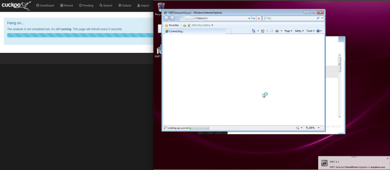

--------------------------------------------------
"Collection" of Cuckoo Sandbox related things  
--------------------------------------------------
(Most things previously published on blog.prowling.nu. I moved some things to github to make updates easier, just in case it would be needed)

* cuckoo-emet.py - Cuckoo with Microsoft Enhanced Mitigation Experience Toolkit (EMET)

To get this to work, Cuckoo requires an extra auxiliary module for this purpose. Along with the Python WMI module installed on the guest, or at least I ended up using the WMI module, but you could easily use pywin32.

As you already have Python installed on the guest, you can use pip to install it.

Cuckoo runs any auxiliary module that is available in the directory:

    cuckoo/analyzer/windows/modules/auxiliary

You need to install EMET (on the guest), make sure it's active. Configure it after your specific needs. As your main goal might not be to block, but to  "only" catch EMET in action, you will need to configure EMET from the default blocking to audit mode. This will allow the malicious code to continue running even if it's detected by EMET.  

You will be able to retrieve what you need from the event log. Copy the cuckoo-emet.py into the above mentioned directory and you are good to go.

Example of EMET events retrieved from the guest:

     [u'EMET', 0, u'Error', u'<COMPUTERNAME>', None, u'EMET version 5.5.5871.31892\nEMET detected MemProt mitigation in iexplore.exe\r\n\r\nMemProt check failed:\n  Application \t: C:\\Program Files\\Internet Explorer\\iexplore.exe\n  User Name \t: <COMPUTERNAME>\\<USER>\n  Session ID \t: 1\n  PID \t\t: 0x474 (1140)\n  TID \t\t: 0x81C (2076)\n  API Name \t: kernel32.VirtualProtect\n  ReturnAddress \t: 0x0000000000446E60\n  CalledAddress \t: 0x000007FEFDA031E0\n  StackPtr \t: 0x00000000029AF4D0\n']

     [u'EMET', 0, u'Error', u'<COMPUTERNAME>', None, u'EMET version 5.5.5871.31892\nEMET detected StackPivot mitigation in iexplore.exe\r\n\r\nStackPivot check failed:\n  Application \t: C:\\Program Files\\Internet Explorer\\iexplore.exe\n  User Name \t: <COMPUTERNAME>\\<USER>\n  Session ID \t: 1\n  PID \t\t: 0x71C (1820)\n  TID \t\t: 0x46C (1132)\n  API name \t: kernel32.WinExec\n  ReturnAddress \t: 0x000000007775C8FF\n  CalledAddress \t: 0x00000000775B8D80\n  Thread stack area range: [0x3172000..0x3180000]\n  StackPtr \t: 0x000000000543FB30\n']
     
     
     
     
* cuckoo-FOG_SSL.txt  - notes on how to use Cuckoo Physical with FOG SSL web interface

By default Cuckoo Physical is unable to communicate with FOG if is configured to use HTTPS only, edit the config file below to get it to work: 

    modules/machinery/physical.py
